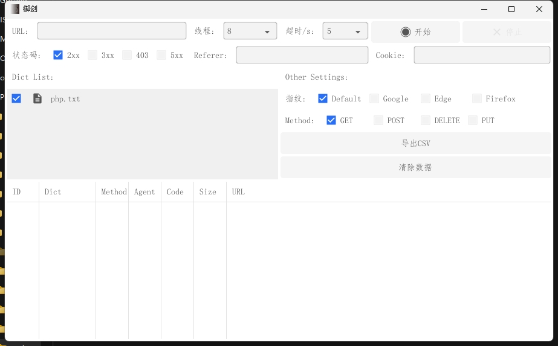

# Go-YuJian

老版本的御剑在win11中无法使用，上次更新也是在4年前，自己仿照写了一个。。。出现问题请提issue，欢迎大家进行pr

## 实现的功能

- [x] URL控制
- [x] 线程控制
- [x] 超时时间控制
- [x] 状态码控制
- [x] Referer修改
- [x] Cookie修改
- [x] 指纹修改
- [x] 请求时方法

## 使用
### URL
地址请携带`http`或者`https://`

### 线程
线程数量不建议太高 建议CPU数量\*5,太高的话会导致软件直接退出,或者导致被扫描网站访问卡顿甚至有可能造成宕机...

### 状态码
请求返回会和勾选的状态码做判断,判断成功的则显示在输出列表中

### Referer
有些网站可能会限制这个东西,看情况加,不懂的直接留空

### Cookie
有些网站可能会限制这个东西,看情况加,不懂的直接留空

### 指纹
User-Agent的内容
Default: R28tWXVKaWFuLzEuMCAoaHR0cHM6Ly9naXRodWIuY29tL0JveUNoYWkvR28tWXVKaWFuLmdpdCk=
Google: Mozilla/5.0 (Windows NT 10.0; Win64; x64) AppleWebKit/537.36 (KHTML, like Gecko) Chrome/124.0.0.0 Safari/537.36
Edge: Mozilla/5.0 (Windows NT 10.0; Win64; x64) AppleWebKit/537.36 (KHTML, like Gecko) Chrome/125.0.0.0 Safari/537.36 Edg/125.0.0.0
Firefox: Mozilla/5.0 (Windows NT 10.0; Win64; x64; rv:125.0) Gecko/20100101 Firefox/125.0

### Method
请求方法,发起请求的方式,默认就是get请求

## 免责

本工具仅用于学习交流，禁止用于其他用途，否则后果自负。

## 鸣谢
感谢BaiPiao设计的图标，非常感谢。

## 捐助

### 微信

### 支付宝

